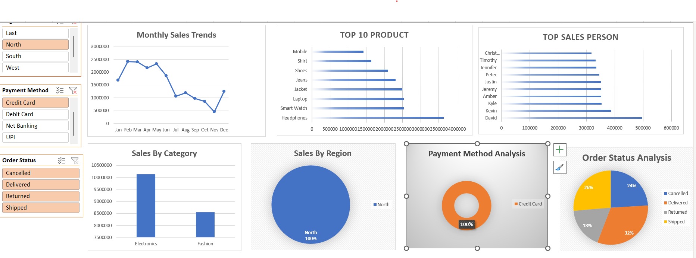

# Ecommerce-Sales-Dashboard
Interactive Sales Dashbaord

# Project Overview
This project is an interactive E-Commerce Sales Dashboard built in Microsoft Excel.
It provides insights into sales performance, profit, customer behavior, product categories, payment methods, and regional performance using Pivot Tables, Pivot Charts, Slicers, and KPI cards.

# Objectives
Analyze overall sales and profit.
Track order quantity and customer trends.
Compare performance by state and product category.
Visualize monthly profit trends.
Filter data interactively using slicers.

# Dashboard Features
Total Sales KPI
Total Profit KPI
Total Quantity Sold
Average Order Value (AOV)
Sales by State
Sales by Customer
Sales by Product Category
Sales by Payment Mode
Monthly Profit Analysis
Interactive Slicers for dynamic filtering

# Microsoft Excel
Pivot Tables
Pivot Charts
Slicers

# Dashboard Preview

# Project Files
Ecommerce-Sales-Dashboard.xlsx – Excel dashboard
dashboard-preview.png – Dashboard screenshot
README.md – Project documentation
ecommerce_sales.csv - csv file

# Key Insights
Identifies top-performing states and customers.
Compares sales across different product categories.
Shows monthly profit trends.
Analyzes preferred payment methods.
Enables quick filtering using slicers for better decision-making.

# Skills Demonstrated
Data Cleaning
Data Analysis
Excel Dashboard Design
Pivot Tables & Pivot Charts
Data Visualization
Business Reporting
KPI Creation

# Author

Karan Chauhan

Aspiring Data Analyst |Microsoft Excel
